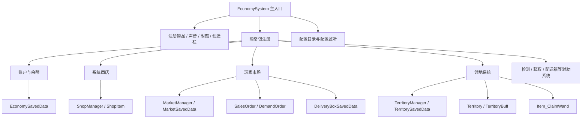

# EconomySystem 开发助手文档（1.21.1 分支）

> 适用项目：`QingMo-A/EconomySystem`  
> 适用分支：`1.21.1`  
> 用途：给开发者、Codex、Claude Code、ChatGPT 等代码助手快速理解项目架构、开发约束、修改入口与注意事项。  
> 说明：本文件基于当前可读取到的 1.21.1 分支核心源码整理。若后续包结构或文件名变化，请以仓库实际代码为准，并同步更新本文件。

---

## 0. 项目一句话定位

EconomySystem 是梦鱼服 / DreamingFish 服务器的 Minecraft 经济基础模组，目标是在 NeoForge 1.21.1 环境下提供统一的服务器经济能力，包括：玩家账户、梦鱼币、系统商店、玩家市场、交易订单、领地系统、回忆/虫洞道具、奖励与管理功能。

**核心规则：本项目只有一种货币：梦鱼币。**

开发时不要引入“金币、点券、宝石、积分”等第二货币概念。所有账户余额、商品价格、交易金额、领地费用、奖励金额，默认都应统一理解为“梦鱼币”。

---

## 1. 技术栈与构建环境

### 1.1 基本信息

| 项目项 | 当前值 |
|---|---|
| Minecraft | `1.21.1` |
| NeoForge | `21.1.228` |
| Java | `21` |
| Mod ID | `economy_system` |
| Group ID | `com.mo.economy_system` |
| Mod Version | `1.3.0` |
| License | `GPL-3.0` |

### 1.2 主要依赖

当前构建脚本中可见的主要依赖：

- `org.xerial:sqlite-jdbc:3.46.1.0`
- `com.zaxxer:HikariCP:5.1.0`
- `software.bernie.geckolib:geckolib-neoforge-1.21.1:4.8.3`
- `mezz.jei:jei-1.21.1-* :19.21.0.247`

注意：当前核心经济、市场、领地数据主要仍使用 `SavedData` / NBT 存储；SQLite 与 HikariCP 是否已真正接入，需要继续检查完整数据层。

### 1.3 常用 Gradle 命令

```bash
./gradlew buildAllTargets
./gradlew runNeoForge1211Client
./gradlew runNeoForge1211Server
./gradlew runNeoForge1211Data
./gradlew buildForge1201
```

Windows 下使用：

```bat
gradlew.bat buildAllTargets
gradlew.bat runNeoForge1211Client
gradlew.bat runNeoForge1211Server
gradlew.bat runNeoForge1211Data
gradlew.bat buildForge1201
```

---

## 2. 项目核心约束

### 2.1 梦鱼币单一货币约束

项目经济系统的所有数值都应统一使用梦鱼币：

- 玩家账户余额
- 玩家转账金额
- 系统商店价格
- 玩家市场订单价格
- 领地购买 / 扩展费用
- 击杀奖励金额
- 后续任务、拍卖、订单、权限玩法费用

**不要设计多币种接口，除非用户明确要求重构为多币种。**

建议统一常量：

```java
public static final String CURRENCY_NAME = "梦鱼币";
```

如果未来需要显示英文，可用：

```java
public static final String CURRENCY_EN_NAME = "MengYu Coin";
```

### 2.2 服务端权威

所有涉及余额、扣款、发货、传送、领地权限的逻辑必须以服务端为准：

- 客户端只能发起请求与展示 UI。
- 服务端必须重新校验余额、物品、权限、距离、维度、订单状态。
- 不要相信客户端传来的价格、余额、订单状态。

### 2.3 数据修改必须标记保存

使用 `SavedData` 的模块，在修改数据后必须调用：

```java
setDirty();
```

否则服务器关闭或世界保存时可能不会持久化。

### 2.4 主世界统一存储

当前部分数据通过主世界 `Level.OVERWORLD` 获取实例，例如账户数据与配送箱数据。开发时应保持一致，避免不同维度产生多份经济数据。

---

## 3. 启动与初始化流程

项目主入口为：

```text
src/main/java/com/mo/economy_system/EconomySystem.java
```

入口类职责：

1. 注册物品：`EconomySystem_Items.register(modEventBus)`
2. 注册声音：`EconomySystem_Sounds.SOUND_EVENTS.register(modEventBus)`
3. 注册附魔：`EconomySystem_Enchants.register(modEventBus)`
4. 注册网络包：`EconomySystem_NetworkManager.register(modEventBus)`
5. 注册创造模式物品栏：`EconomySystem_CreativeTabs.CREATIVE_TABS.register(modEventBus)`
6. 注册通用配置：`modContainer.registerConfig(ModConfig.Type.COMMON, Config.SPEC)`
7. 初始化配置目录：`new Init()`
8. 启动商店配置监听：`new ShopConfigWatcher(SHOP_MANAGER).watchConfigFile()`
9. 启动奖励配置监听：`new RewardConfigWatcher(REWARD_MANAGER).watchConfigFile()`

配置目录初始化路径来自：

```text
config/economy_system/
```

代码入口：

```text
src/main/java/com/mo/economy_system/init/Init.java
```

---

## 4. 当前模块地图



---

## 5. 核心包与职责

### 5.1 主包

```text
com.mo.economy_system
```

| 文件 / 包 | 职责 |
|---|---|
| `EconomySystem.java` | Mod 主入口，注册所有核心系统 |
| `Config.java` | 当前仍有 NeoForge MDK 示例配置残留，需要清理为项目真实配置 |
| `init.Init` | 创建 `config/economy_system/` 目录 |

### 5.2 物品系统

```text
com.mo.economy_system.item
com.mo.economy_system.item.items
```

已注册物品包括：

- `guitar`
- `wormhole_potion`
- `recall_potion`
- `claim_wand`
- `supporter_hat`

注册入口：

```text
src/main/java/com/mo/economy_system/item/EconomySystem_Items.java
```

领地相关重要物品：

```text
src/main/java/com/mo/economy_system/item/items/Item_ClaimWand.java
```

圈地杖逻辑：

- 第一次右键：记录第一个点。
- 第二次右键：记录第二个点。
- 第三次右键：取消选择。
- 要求两点 Y 坐标一致。
- 领地按 X/Z 平面计算面积。
- 当前费用为：`面积 * 20` 梦鱼币。
- 支持普通圈地和修改领地范围。
- 会检查同维度下与已有领地的重叠。

注意点：

- `Item_ClaimWand` 中存在 `ScheduledExecutorService` 超时任务。Minecraft 服务端对象通常应在服务器主线程操作，后续建议改为服务端 tick 计时或 `server.execute(...)` 切回主线程后再发消息 / 改状态。
- `calculateVolume` 实际计算的是 X/Z 面积，不是体积。建议后续命名为 `calculateArea`。

### 5.3 网络系统

```text
com.mo.economy_system.network
com.mo.economy_system.network.packets
```

网络注册入口：

```text
src/main/java/com/mo/economy_system/network/EconomySystem_NetworkManager.java
```

当前网络包分组大致包括：

#### 经济系统

- `Packet_BalanceRequest`
- `Packet_BalanceResponse`
- `Packet_Transfer`
- `Packet_ShopDataRequest`
- `Packet_ShopDataResponse`
- `Packet_ShopBuyItem`
- `Packet_MarketDataRequest`
- `Packet_MarketDataResponse`

#### 销售订单

- `Packet_CreateSalesOrder`
- `Packet_PurchaseSalesOrder`
- `Packet_RemoveSalesOrder`

#### 求购订单

- `Packet_CreateDemandOrder`
- `Packet_ConfirmDemandOrder`
- `Packet_DeliverDemandOrder`
- `Packet_RemoveDemandOrder`

#### 领地系统

- `TerritoryDataRequestMessage`
- `TerritoryDataResponseMessage`
- `Packet_SingleTerritoryDataRequest`
- `Packet_SingleTerritoryDataResponse`
- `TeleportToTerritoryMessage`
- `Packet_InvitePlayer`
- `Packet_RemoveTerritory`
- `Packet_RemovePlayer`
- `Packet_ModifyMode`
- `Packet_UnlockTerritoryBuff`
- `Packet_UpgradeTerritoryBuff`

#### 检测 / 获取 / 配送箱 / 玩家列表

- `Packet_Check`
- `Packet_CheckResultRequest`
- `Packet_CheckResultResponse`
- `Packet_Get`
- `Packet_GetResultRequest`
- `Packet_GetResultResponse`
- `Packet_Chunk`
- `Packet_ChunkResponse`
- `Packet_DeliveryBoxDataRequest`
- `Packet_DeliveryBoxDataResponse`
- `Packet_DeliveryBoxClaimItem`
- `Packet_ServerPlayerListRequest`
- `Packet_ServerPlayerListResponse`

新增网络包时推荐流程：

1. 新建 packet class。
2. 定义 `TYPE`。
3. 定义 `STREAM_CODEC`。
4. 实现 `encode/decode`。
5. 实现 `handle`，并用 `context.enqueueWork(...)` 执行业务逻辑。
6. 在 `EconomySystem_NetworkManager.registerPayloadHandlers` 中注册。
7. 涉及经济变动时，服务端重新校验余额与权限。

### 5.4 玩家账户与余额系统

核心文件：

```text
src/main/java/com/mo/economy_system/core/economy_system/EconomySavedData.java
```

数据名：

```java
private static final String DATA_NAME = "economy_data";
```

主要数据结构：

```java
Map<UUID, Integer> accounts
Map<UUID, List<String>> offlineMessages
```

核心方法：

- `getBalance(UUID)`：获取余额。
- `setBalance(UUID, int)`：设置余额，最低为 0。
- `addBalance(UUID, int)`：增加余额，最大不超过 `Integer.MAX_VALUE`。
- `minBalance(UUID, int)`：扣除余额，余额不足返回 false。
- `hasEnoughBalance(UUID, int)`：检查余额是否足够。
- `getAllAccounts()`：按余额降序获取账户列表。
- `storeOfflineMessage(...)` / `getOfflineMessages(...)`：离线消息。

当前金额类型为 `int`，因此要注意：

- 大额交易可能溢出。
- 领地面积费用使用 `long` 计算，但最终如果接入账户余额仍需要安全转换。
- 如果后续经济规模扩大，建议统一改为 `long`。

### 5.5 系统商店

核心文件：

```text
src/main/java/com/mo/economy_system/core/economy_system/shop/ShopManager.java
src/main/java/com/mo/economy_system/core/economy_system/shop/ShopItem.java
```

配置文件：

```text
config/economy_system/economy_shop.json
```

商店数据：

- `itemId`
- `description`
- `basePrice`
- `currentPrice`
- `lastPrice`
- `fluctuationFactor`
- `nbt`

默认商品包括：

- 回忆药水
- 虫洞药水
- 自定义附魔书
- 各类建筑方块 / 原木 / 树苗 / 树叶 / 混凝土 / 羊毛等

价格系统：

- `adjustPrices()` 会根据当前价与基础价偏离程度进行随机波动。
- 当前价格最低为 1，最高为基础价格 5 倍。
- 价格波动后会保存回 `economy_shop.json`。

注意点：

- `ShopItem.applyEnchantmentNBT` 目前通过 `DataComponents.CUSTOM_DATA` 写入 NBT。Minecraft 1.21.1 的物品组件系统中，附魔书等数据可能需要使用对应 DataComponent，而不是仅写 `CUSTOM_DATA`。如果附魔书购买后附魔无效，应重点检查这里。
- 配置文件监听器会热加载商店配置，后续新增字段时要兼容旧 JSON。

### 5.6 奖励系统

核心文件：

```text
src/main/java/com/mo/economy_system/core/economy_system/reward/RewardManager.java
```

配置文件：

```text
config/economy_system/economy_rewards.json
```

奖励条目结构：

```java
RewardEntry {
    String type;
    double dropChance;
    int dropMin;
    int dropMax;
}
```

默认配置包含多种敌对生物，例如：

- 僵尸
- 骷髅
- 苦力怕
- 蜘蛛
- 女巫
- 末影人
- 凋灵
- 末影龙

注意点：

- 当前 `rewards` 是 `static final List`，多实例或重载时要注意状态污染。
- 若奖励为梦鱼币，应在显示、日志、配置说明中明确“金额单位为梦鱼币”。

### 5.7 玩家市场 / 订单系统

核心文件：

```text
src/main/java/com/mo/economy_system/core/economy_system/market/MarketManager.java
src/main/java/com/mo/economy_system/core/economy_system/market/MarketSavedData.java
src/main/java/com/mo/economy_system/core/economy_system/market/MarketItem.java
src/main/java/com/mo/economy_system/core/economy_system/market/SalesOrder.java
src/main/java/com/mo/economy_system/core/economy_system/market/DemandOrder.java
```

数据名：

```java
private static final String DATA_NAME = "market_data";
```

市场订单基类 `MarketItem` 包含：

- `tradeID`
- `itemID`
- `itemStack`
- `basePrice`
- `sellerName`
- `sellerID`
- `listingTime`
- `expirationTime`

订单类型：

- `SalesOrder`：出售订单。
- `DemandOrder`：求购订单，额外字段 `delivered`。

订单过期：

```java
EXPIRATION_DURATION = 3 * 24 * 60 * 60 * 1000L
```

也就是上架后 3 天过期。

注意点：

- `MarketItem.toNBT()` 保存了 Java 类完整类名作为 `type`，例如 `com.mo.economy_system.core.economy_system.market.SalesOrder`。如果未来重命名包或类，旧存档会无法反序列化。建议未来改为稳定类型 ID，如 `sales_order` / `demand_order`。
- `MarketManager` 使用静态内存列表保存市场条目，并提供 `saveTo(ServerLevel)` 写入 `MarketSavedData`。需要检查服务端启动时是否有统一从 `MarketSavedData` 加载到 `MarketManager` 的流程。
- 所有市场价格都应视为梦鱼币。

### 5.8 配送箱系统

核心文件：

```text
src/main/java/com/mo/economy_system/core/economy_system/delivery_box/DeliveryBoxSavedData.java
src/main/java/com/mo/economy_system/core/economy_system/delivery_box/DeliveryItem.java
```

数据名：

```java
private static final String DATA_NAME = "delivery_box_data";
```

用途推测：

- 玩家市场或订单完成后，如果物品无法直接交付，可以进入玩家配送箱。
- 玩家后续通过网络包查询、领取。

`DeliveryItem` 字段：

- `dataID`
- `itemID`
- `itemStack`
- `source`

注意点：

- `getItems(UUID)` 当前返回原列表或新列表，若返回原列表可能被外部修改。建议返回副本。
- `getItemStack()` 当前直接返回 `itemStack`，建议返回 `copy()`，避免外部修改内部存储对象。

### 5.9 领地系统

核心文件：

```text
src/main/java/com/mo/economy_system/core/territory_system/TerritoryManager.java
src/main/java/com/mo/economy_system/core/territory_system/TerritorySavedData.java
src/main/java/com/mo/economy_system/core/territory_system/Territory.java
src/main/java/com/mo/economy_system/item/items/Item_ClaimWand.java
```

数据名：

```java
private static final String DATA_NAME = "territory_data";
```

配置文件：

```text
config/economy_system/territory_buffs.json
```

核心设计：

- 领地有唯一 `territoryID`。
- 领地记录所有者 UUID / 名称。
- 领地保存两个坐标点。
- 有权限玩家使用 `PlayerInfo` 集合保存。
- 支持回城点 `backpoint`。
- 保存所在维度 `ResourceKey<Level>`。
- 支持 `TerritoryBuff` 列表。
- 查询使用 `QuadTree` 优化 X/Z 坐标检索。

特别注意：

- 当前 README 写的是 2D 领地，代码中也有 `isWithinBoundsIgnoreY` 与 `getBounds()` 主要按 X/Z 处理。
- `TerritoryManager.getTerritoryAtIgnoreY(ResourceKey<Level>, int x, int z)` 已做维度判断，优先使用这个重载，避免不同维度同坐标互相误判。
- `TerritoryManager.getTerritoryAtIgnoreY(int x, int z)` 不带维度，后续新代码尽量不要再用。
- 圈地价格目前为每格 20 梦鱼币。

---

## 6. 数据存储总览

| 数据 | 类 | 存储方式 | 数据名 / 文件 |
|---|---|---|---|
| 玩家余额 / 离线消息 | `EconomySavedData` | `SavedData` / NBT | `economy_data` |
| 玩家市场 | `MarketSavedData` | `SavedData` / NBT | `market_data` |
| 配送箱 | `DeliveryBoxSavedData` | `SavedData` / NBT | `delivery_box_data` |
| 领地 | `TerritorySavedData` | `SavedData` / NBT | `territory_data` |
| 系统商店 | `ShopManager` | JSON | `config/economy_system/economy_shop.json` |
| 击杀奖励 | `RewardManager` | JSON | `config/economy_system/economy_rewards.json` |
| 领地 Buff | `TerritoryBuffManager` | JSON | `config/economy_system/territory_buffs.json` |

---

## 7. 常见开发任务入口

### 7.1 新增一个普通物品

1. 在 `item/items/` 下创建物品类。
2. 在 `EconomySystem_Items.java` 添加 `DeferredHolder`。
3. 在创造栏注册中加入显示。
4. 添加模型、贴图、语言文件。
5. 如果涉及服务端逻辑，保证只在服务端修改数据。

### 7.2 新增一个网络交互

1. 在对应 packet 包中创建 `Packet_xxx`。
2. 写 `TYPE`、`STREAM_CODEC`、`encode`、`decode`、`handle`。
3. 在 `EconomySystem_NetworkManager` 注册。
4. 客户端只发送意图，服务端重新校验。
5. 所有扣款 / 发货 / 修改领地都必须服务端执行。

### 7.3 新增系统商店商品

优先改配置文件：

```text
config/economy_system/economy_shop.json
```

若要改默认生成商品：

```text
ShopManager.saveDefaultConfig()
```

新增字段时要保证旧配置兼容。

### 7.4 新增一种市场订单类型

当前 `MarketItem.fromNBT()` 用 `switch(type)` 分发子类。新增订单类型需要：

1. 创建新的 `MarketItem` 子类。
2. 实现 `toNBT()` / `fromNBT()`。
3. 修改 `MarketItem.fromNBT()`。
4. 添加对应网络包。
5. 添加 UI 展示逻辑。
6. 处理订单过期、退款、配送箱交付。

建议先把 `type` 从类完整名改为稳定字符串，再扩展订单类型。

### 7.5 新增领地功能

优先从这些位置入手：

- 数据字段：`Territory.java`
- 持久化：`Territory.toNBT()` / `Territory.fromNBT()`
- 查询与缓存：`TerritoryManager.java`
- 网络同步：`network.packets.territory_system`
- UI 展示：客户端 screen / menu 相关类
- 权限校验：所有服务端操作 packet handler

新增领地权限时，应区分：

- 所有者
- 被授权成员
- 普通玩家
- 管理员 / OP

### 7.6 新增经济奖励

优先改：

```text
config/economy_system/economy_rewards.json
```

若要改默认生成：

```text
RewardManager.saveDefaultConfig()
```

奖励应明确单位为梦鱼币，并在服务端发放。

---

## 8. 已发现的重构点 / 风险点

### 8.1 `Config.java` 仍是 MDK 示例配置

当前 `Config.java` 中仍包含：

- `logDirtBlock`
- `magicNumber`
- `magicNumberIntroduction`
- 示例 `items`

这些与 EconomySystem 实际业务无关。建议重构为：

- `startingBalance`
- `territoryPricePerBlock`
- `enableKillReward`
- `enablePlayerMarket`
- `marketOrderExpireDays`
- `currencyDisplayName = 梦鱼币`

### 8.2 金额类型建议从 `int` 评估升级为 `long`

当前账户余额为 `int`，最大值 `Integer.MAX_VALUE`。如果服务器长期运行或有高价订单，可能不够安全。建议统一封装金额类型，避免到处裸用 `int`。

### 8.3 `MarketItem` 使用类全名作为存档类型

当前保存：

```java
tag.putString("type", this.getClass().getName());
```

问题：重命名类或包会破坏旧存档。

建议改成：

```java
tag.putString("type", "sales_order");
tag.putString("type", "demand_order");
```

并在读取时兼容旧类名。

### 8.4 `Item_ClaimWand` 中后台线程可能触碰服务端对象

`ScheduledExecutorService` 的超时任务中会修改静态 Map，并向玩家发送系统消息。建议改为服务端 tick 计时，或者在任务触发时调用 `server.execute(...)` 切回主线程。

### 8.5 商店附魔书 NBT 可能不适配 1.21.1 组件系统

`ShopItem` 通过 `CUSTOM_DATA` 写入旧式 NBT 字符串。1.21.1 的物品数据更多转向 DataComponent，若附魔书不能正常生效，应优先检查这里。

### 8.6 部分集合返回值建议返回副本

例如配送箱、市场、领地等内部集合，外部读取时建议返回副本或不可变视图，避免调用方绕过管理器直接改数据。

### 8.7 日志建议统一使用 `EconomySystem.LOGGER`

目前部分代码使用 `System.out.println` / `System.err.println`。建议改为：

```java
EconomySystem.LOGGER.info(...);
EconomySystem.LOGGER.warn(...);
EconomySystem.LOGGER.error(..., e);
```

---

## 9. 推荐的下一步开发路线

### 第一阶段：稳定经济核心

- 清理 `Config.java` 示例配置。
- 抽象 `Currency` / `Money` 工具类，但保持单一货币梦鱼币。
- 将金额显示统一封装，例如 `MoneyFormatter.format(amount)`。
- 统一余额增减接口，避免业务代码直接操作 `SavedData`。

### 第二阶段：稳定市场订单

- 检查市场数据加载流程。
- 统一订单状态：上架中、已交付、已完成、已取消、已过期。
- 给订单过期退款和配送箱加明确流程。
- 将 `MarketItem.type` 改为稳定 ID 并兼容旧存档。

### 第三阶段：完善领地系统

协议 17–19 已完成 bridge 迁移与最终加固。协议 19 的 common reserve 工厂在返回前完成写入与 dirty mark，并自行补偿失败；客户端同步是 best-effort。reservation 是 one-shot，commit 不做 I/O；arrival UNKNOWN 不自动退款并返回状态不确定。限流器按服务器弱引用隔离且支持 tick epoch reset。Forge/NeoForge 生产库存 helper 只扫描 `inventory.items`。Forge 只读页保留不重叠 UUID hitbox 与滚轮滚动。协议 20 及之后仍保持 legacy，必须按单协议任务继续迁移。

- 将“面积”命名修正，避免 volume 概念混乱。
- 将领地价格放入配置。
- 完善领地权限：破坏、放置、交互、容器、实体伤害、传送。
- 优先使用带维度的领地查询。

### 第四阶段：UI 与体验

- UI 底层重做。
- 所有金额显示统一为 `梦鱼币`。
- 玩家市场增加筛选、排序、搜索。
- 领地界面增加成员管理、权限开关、Buff 升级说明。

---

## 10. 给 AI 代码助手的开发规则

当你作为代码助手修改本项目时，请遵守：

1. 默认使用中文解释，但代码、类名、方法名保持 Java 项目风格。
2. 默认目标版本是 Minecraft `1.21.1` + NeoForge `21.1.228` + Java `21`。
3. 货币只有一种：`梦鱼币`。不要引入多货币模型。
4. 涉及钱的逻辑必须在服务端重新校验。
5. 不要相信客户端传来的价格、余额、订单状态。
6. 修改 `SavedData` 后必须 `setDirty()`。
7. 新增 packet 后必须在 `EconomySystem_NetworkManager` 注册。
8. 新增物品后必须注册、补资源、补语言、补创造栏。
9. 涉及物品序列化时优先检查 1.21.1 DataComponent 兼容性。
10. 不要在非服务端主线程直接操作世界、玩家、实体、发消息或修改游戏状态。
11. 尽量保留旧存档兼容，尤其是市场订单、领地、玩家余额。
12. 大改前先说明影响范围：网络包、SavedData、UI、配置、语言文件、旧存档。

---

## 11. 修改前检查清单

开发任何新功能前，先问自己：

- 这个功能是否涉及梦鱼币？
- 是否需要服务端校验？
- 是否需要网络包？
- 是否需要 `SavedData` 或 JSON 配置持久化？
- 是否需要同步到客户端 UI？
- 是否需要语言文件？
- 是否会破坏旧存档？
- 是否要兼容离线玩家？
- 是否要考虑跨维度？
- 是否要考虑服务器重启后的恢复？

---

## 12. 常用路径速查

```text
src/main/java/com/mo/economy_system/EconomySystem.java
src/main/java/com/mo/economy_system/Config.java
src/main/java/com/mo/economy_system/init/Init.java
src/main/java/com/mo/economy_system/item/EconomySystem_Items.java
src/main/java/com/mo/economy_system/network/EconomySystem_NetworkManager.java
src/main/java/com/mo/economy_system/core/economy_system/EconomySavedData.java
src/main/java/com/mo/economy_system/core/economy_system/shop/ShopManager.java
src/main/java/com/mo/economy_system/core/economy_system/shop/ShopItem.java
src/main/java/com/mo/economy_system/core/economy_system/reward/RewardManager.java
src/main/java/com/mo/economy_system/core/economy_system/market/MarketManager.java
src/main/java/com/mo/economy_system/core/economy_system/market/MarketSavedData.java
src/main/java/com/mo/economy_system/core/economy_system/market/MarketItem.java
src/main/java/com/mo/economy_system/core/economy_system/market/SalesOrder.java
src/main/java/com/mo/economy_system/core/economy_system/market/DemandOrder.java
src/main/java/com/mo/economy_system/core/economy_system/delivery_box/DeliveryBoxSavedData.java
src/main/java/com/mo/economy_system/core/economy_system/delivery_box/DeliveryItem.java
src/main/java/com/mo/economy_system/core/territory_system/TerritoryManager.java
src/main/java/com/mo/economy_system/core/territory_system/TerritorySavedData.java
src/main/java/com/mo/economy_system/core/territory_system/Territory.java
src/main/java/com/mo/economy_system/item/items/Item_ClaimWand.java
src/main/java/com/mo/economy_system/utils/ItemStackDataHelper.java
src/main/resources/economy_system.mixins.json
src/main/templates/META-INF/neoforge.mods.toml
```

---

## 13. 后续需要继续补全的阅读范围

当前文档已经覆盖入口、构建、网络注册、账户、商店、市场、配送箱、领地、奖励、物品序列化等核心模块。后续如果要进一步完善，请继续阅读并补充：

- 客户端 Screen / GUI / Menu 相关包。
- 所有 packet handler 的具体扣款、退款、发货流程。
- 所有事件监听器，例如玩家登录、世界加载、实体死亡、方块交互、领地保护相关事件。
- 命令注册与 `/setbackpoint` 等命令实现。
- 语言文件、模型、贴图、创造栏显示。
- SQLite / HikariCP 是否已有实际数据层。
- GeckoLib 相关动画物品 / 支持者帽子实现。

