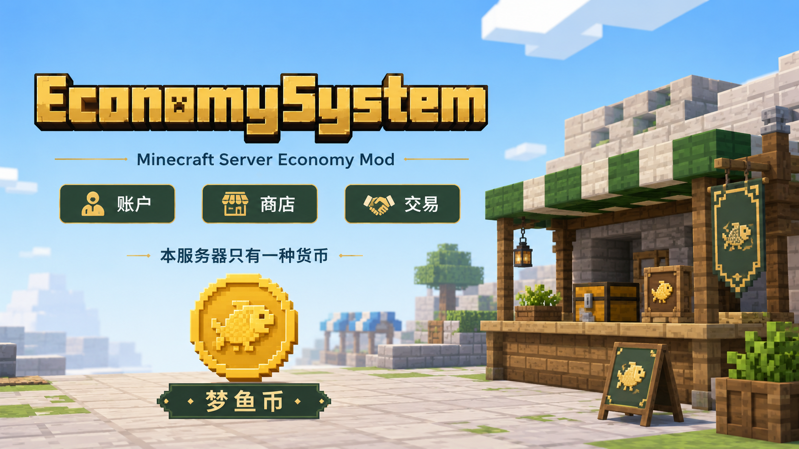
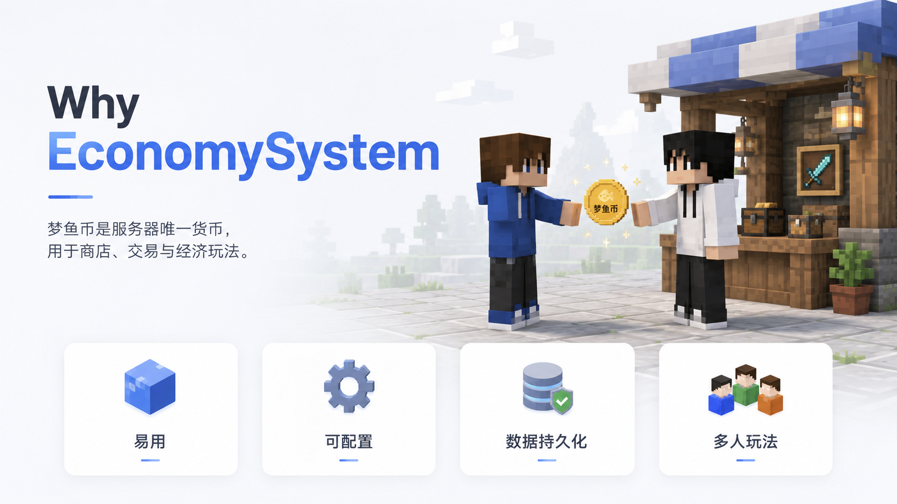
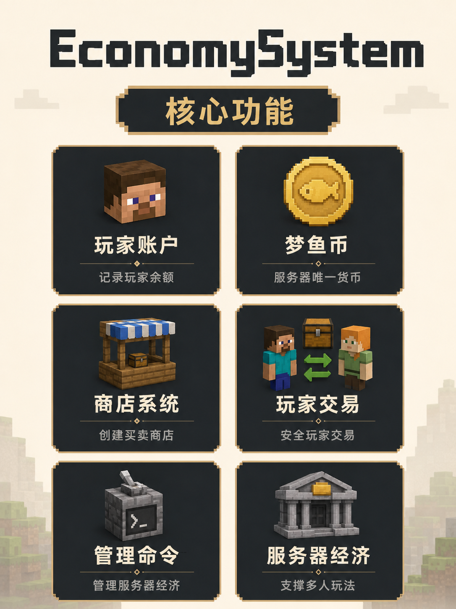
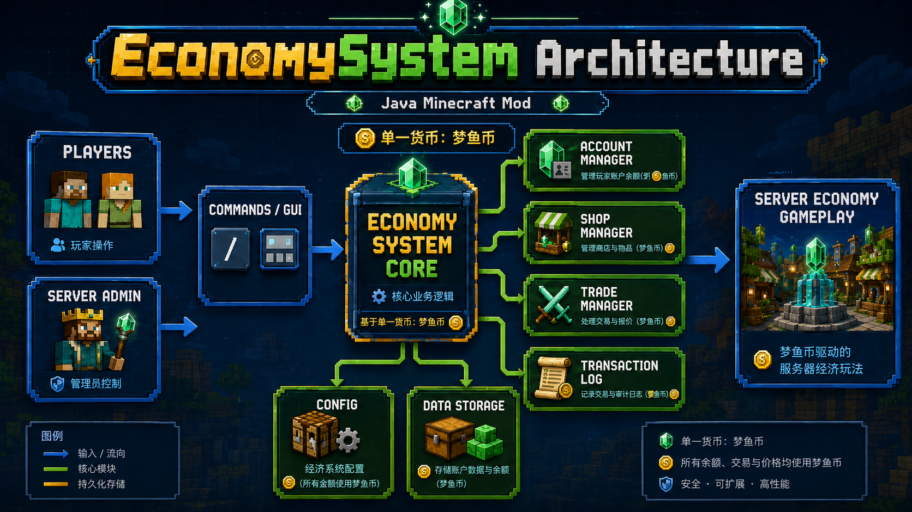
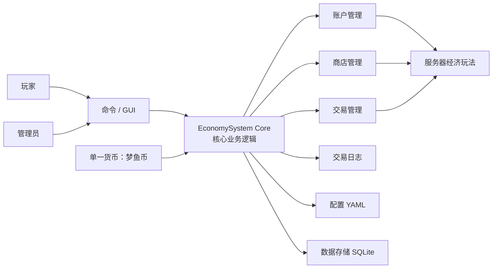

<p align="center">
  
</p>

<h1 align="center">EconomySystem · 经济系统</h1>

<p align="center">
  为 Minecraft / 梦鱼服打造的多功能服务器经济与玩法基础模组。
</p>

<p align="center">
  
  
  
</p>

---

## 项目介绍

**EconomySystem（经济系统）** 是一款面向 Minecraft 多人服务器的经济系统模组，围绕服务器内的统一货币、玩家账户、商店交易、玩家市场、领地与传送玩法进行设计。

在梦鱼服中，经济系统只使用一种官方货币：**梦鱼币**。所有玩家余额、商品价格、交易金额、领地花费与经济玩法，均围绕梦鱼币展开，避免多货币体系带来的理解成本和数值混乱。

<p align="center">
  
</p>

---

## 核心特点

| 功能 | 说明 |
| --- | --- |
| **玩家账户** | 记录并管理玩家的梦鱼币余额。 |
| **梦鱼币** | 服务器唯一货币，用于商店、交易、领地与其他经济玩法。 |
| **系统商店** | 提供服务器商店，商品价格会随游戏时间刷新并产生浮动。 |
| **玩家市场** | 支持玩家出售物品，并查看卖家等物品信息。 |
| **玩家交易** | 围绕梦鱼币构建玩家间交易与资源流通。 |
| **领地系统** | 使用梦鱼币创建 2D 领地，支持管理与传送。 |
| **传送药水** | 虫洞药水与回忆药水提供更丰富的服务器玩法。 |
| **管理扩展** | 为后续订单、权限、UI 重构等功能预留扩展空间。 |

<p align="center">
  
</p>

---

## 系统架构

EconomySystem 的整体逻辑可以理解为：玩家或管理员通过 **命令 / GUI** 进行操作，经济系统核心负责账户、商店、交易、日志等业务处理，并通过配置文件和数据存储保持服务器经济数据稳定。

<p align="center">
  
</p>



---

## 使用教程

### 1. 打开菜单

- 默认按键为 **I**。
- 按下 **I** 可以打开经济系统菜单。
- 如有需要，可以在按键设置中搜索“打开菜单”并自行修改快捷键。

### 2. 系统商店

- 系统商店会出售一些服务器内物品。
- 商品价格会根据游戏时间刷新，例如正午或午夜。
- 商品价格存在浮动，当前价格浮动范围为 **0.5 ~ 1.5**。
- 将鼠标移动到物品图标上，可以查看物品详细信息。

### 3. 玩家市场

- 玩家可以在市场中出售物品。
- 玩家购买物品时，可以查看卖家等相关信息。
- 将鼠标移动到物品图标上，可以查看物品详情。

### 4. 我的领地（2D 领地）

领地系统基于 2D 区域选择，适合服务器中轻量化管理玩家空间。

#### 圈地方式

- 使用 **圈地杖** 进行圈地。
- 圈地杖可以通过一根木棍合成。
- 手持圈地杖时：
  1. 第一次右键方块，选择第一个点。
  2. 第二次右键方块，选择第二个点。
  3. 第三次右键方块，取消当前选择。

#### 领地花费与管理

- 每个格子需要 **20 枚梦鱼币**。
- 创建领地后，领地所有者可以管理或传送到领地。
- 成员仅能传送到领地，不能进行所有者管理操作。
- 所有者可以在任一领地输入：

```mcfunction
/setbackpoint
```

用于设定回城点。默认回城点为第一个圈地点。

### 5. 领地图标

所有者会根据领地所在维度显示不同图标：

| 维度 | 所有者图标 |
| --- | --- |
| 主世界 | 草方块 |
| 下界 | 地狱岩 |
| 末地 | 末地石 |

成员显示为：**木门**。

### 6. 虫洞 / 回忆药水

- **虫洞药水**：可在系统商店购买。使用后，可以使用 `tpa` 指令。
- **回忆药水**：可直接饮用，传送到出生点，也可以用于传送到领地。
- 目前已知问题：回忆药水存在不可堆叠 bug。

---

## 版本分支

请根据你的 Minecraft 版本选择对应分支：

- [1.20.1 分支](https://github.com/QingMo-A/EconomySystem/tree/1.20.1)
- [1.21.1 分支](https://github.com/QingMo-A/EconomySystem/tree/1.21.1)

如果你只是想体验最新构建，可以优先查看仓库的 [Releases](https://github.com/QingMo-A/EconomySystem/releases)。

---

## ToDo / 计划实现

功能不分先后，以下功能后续都有可能继续完善：

- UI 底层重做
- 订单查询
- 订单逻辑
- 领地权限
- ~~拍卖订单~~
- 赞助者玩偶 / 雕塑 / 名单

---

## 赞助者名单

排名不分前后，也与赞助金额无关。

| 姓名 | 赞助金额 |
| --- | ---: |
| poxiaojin | 20.00¥ |
| YHS116284 | 12.01¥ |
| 351987654321 | 35.10¥ |
| bugong | 1.50¥ |

感谢以上赞助者对项目的支持！你的支持使得项目可以持续进行和优化。

---

## 作者

- [QingMo](https://github.com/QingMo-A)
- [HanHanYu](https://github.com/HanHanYu)

---

## 许可证

本项目基于 **GPL-3.0 License** 开源，详细内容请查看 [LICENSE](LICENSE) 文件。
