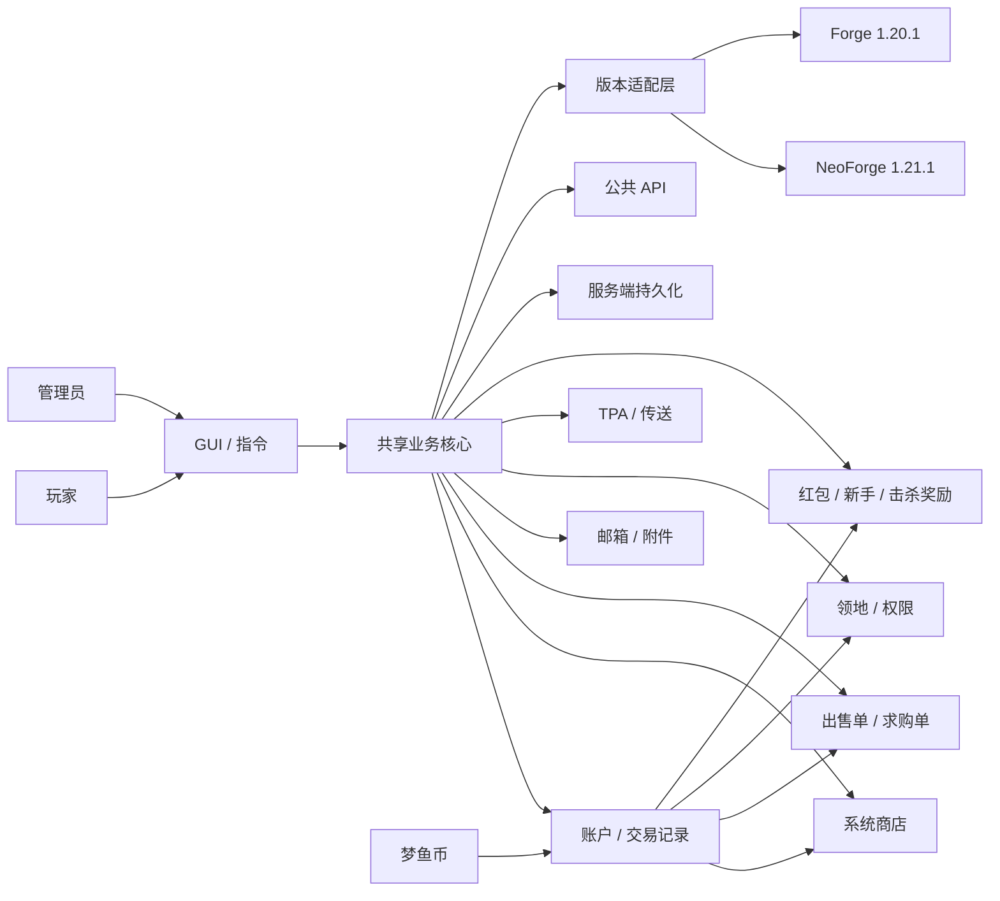

  

<h1 align="center">EconomySystem · 经济系统</h1>

  为 Minecraft 多人服务器打造的经济、商店、玩家市场、邮箱、领地与交易基础模组。

  
  
  
  
  
  
  

---

## 项目介绍

**EconomySystem（经济系统）** 是一款面向 Minecraft 多人服务器的综合服务器玩法模组。项目以经济系统为核心，并逐步扩展出系统商店、玩家市场、邮箱、领地、玩家传送、红包、新手奖励、击杀奖励以及服务器管理工具。

在梦鱼服中，经济系统统一使用 **梦鱼币**。玩家余额、系统商店、市场订单、玩家转账、领地花费和其他经济玩法均围绕这一货币运行。

  

> 本 README 以当前 `bridge` 开发线，尤其是 **NeoForge 1.21.1** 的现行实现为主要依据。Forge 1.20.1 使用同一套跨版本业务核心，但部分界面表现与新版本可能存在差异。

---

## 支持版本

当前仓库采用多目标结构：

| Minecraft | 加载器 | Java | 说明 |
| --- | --- | ---: | --- |
| **1.21.1** | **NeoForge** | 21 | 当前默认目标，也是主要功能与 UI 开发基线 |
| **1.20.1** | **Forge** | 17 | 跨版本适配目标，共享核心业务逻辑 |

对应分支：

- [1.21.1](https://github.com/QingMo-A/EconomySystem/tree/1.21.1)
- [1.20.1](https://github.com/QingMo-A/EconomySystem/tree/1.20.1)
- [bridge](https://github.com/QingMo-A/EconomySystem/tree/bridge) — 当前跨版本开发与整合分支
- [Releases](https://github.com/QingMo-A/EconomySystem/releases) — 已发布构建

---

## 功能总览

  

| 系统 | 当前功能 |
| --- | --- |
| **梦鱼币 / 玩家账户** | 玩家余额、增减/设置、玩家转账、精确余额事务与经济记录。 |
| **系统商店** | 服务器商品目录、动态价格刷新、购买校验、管理员主手添加商品及配置热重载。 |
| **玩家市场** | 出售单、求购单、按数量成交、部分成交、订单过期、撤单/交付及客户端实时失效刷新。 |
| **邮箱系统** | 玩家互发邮件、物品附件、附件领取/全部领取、未读状态、删除保护、新邮件通知、系统公告、通知和补偿邮件。 |
| **交易 / 记录** | 玩家转账、商店和市场等经济行为统一进入服务端账户与记录体系。 |
| **领地系统** | 2D 圈地、调整范围、成员邀请/移除、权限规则、回城点、领地传送、领地 Buff 与边界提示。 |
| **领地权限** | 放置方块、破坏方块、使用物品、交互方块、打开容器；每项可配置为仅领主 / 领地成员 / 所有人。 |
| **TPA** | `/tpa` 请求、接受、拒绝、超时处理，与虫洞药水消费流程联动。 |
| **红包系统** | 幸运红包、均分红包、领取、指定发送者领取、取消与余额返还。 |
| **新手奖励** | 玩家可领取一次性新手奖励，并防止重复领取。 |
| **击杀奖励** | 可按服务器奖励配置向击杀生物的玩家发放梦鱼币，并支持奖励相关附魔参与计算。 |
| **信息 / 管理工具** | 玩家、领地、物品信息查询；管理员客户端文件核验与经授权的文件获取流程。 |
| **跨模组 API** | 账户、市场、邮箱、领地等核心能力提供公共 API / 平台适配接口，便于其他模组接入。 |

---

## 主要系统

### 1. 玩家账户与梦鱼币

玩家拥有独立的梦鱼币账户。经济核心负责余额读取、增加、扣除、设置和玩家间转账，并为市场、系统商店、领地与奖励系统提供统一的服务端经济基础。

常用操作：

- 查询自己的余额；
- 向在线玩家转账；
- 管理员调整玩家余额；
- 查看经济相关记录；
- 由其他系统通过统一事务接口完成收款、付款与回滚。

### 2. 系统商店

系统商店由服务器维护商品目录，玩家可以使用梦鱼币直接购买商品。

  

当前实现包括：

- 服务端权威商品目录与价格；
- 商品价格浮动；
- 每个 Minecraft 日进行两次价格刷新；
- 刷新后向在线客户端同步最新目录；
- 购买时进行余额、库存空间等服务端校验；
- 管理员可将主手物品直接加入系统商店；
- 系统设置和价格配置支持运行时重载。

### 3. 玩家市场

市场不再只是简单的“上架一个物品并整单购买”，当前已经具有完整的订单模型。

  

  

目前支持：

- **出售单（Sales Order）**：玩家上架物品，其他玩家购买；
- **求购单（Demand Order）**：玩家预先发布购买需求，其他玩家向订单交付物品；
- 按数量购买或交付；
- 部分成交后保留剩余数量；
- 服务端重新校验订单状态，避免使用过期客户端数据重复成交；
- 订单变化后向客户端广播失效信息并刷新市场；
- 订单过期处理；
- 交易失败时执行库存、余额和订单状态回滚。

### 4. 邮箱系统

邮箱已经替代“单纯收货箱”成为统一的消息与附件入口。

当前支持：

- 玩家向其他玩家发送邮件；
- 邮件主题与正文；
- 从背包选择物品作为附件发送；
- 单个附件领取和全部领取；
- 已读 / 未读状态；
- 有未领取附件时禁止直接删除邮件；
- 新邮件到达时客户端通知；
- 邮箱容量限制，避免将邮箱作为无限物品存储；
- 管理员发布系统公告；
- 管理员发送指定玩家的系统通知；
- 管理员发送带主手物品副本的补偿邮件；
- 市场求购交付等业务可通过邮箱投递流程完成物品交接。

玩家邮件附件在发送时会从发送者背包中移除；若持久化或投递失败，服务端会尝试回滚原物品，避免复制或无故丢失。

### 5. 交易与经济记录

  

玩家转账、管理员余额操作、市场支付、奖励等经济行为统一使用服务端账户逻辑。当前客户端也已经提供余额记录查询界面，便于玩家查看经济变化。

### 6. 领地系统

领地使用 2D X/Z 区域进行管理。玩家使用圈地工具选择两个点后创建领地，并可继续在领地管理界面调整范围、管理成员和配置规则。

#### 圈地与调整

- 使用 **圈地杖** 选择区域；
- 第一次右键选择第一个点；
- 第二次右键选择第二个点；
- 再次操作可取消当前选择；
- 创建领地和扩大领地会进入服务端经济事务；
- 修改范围时会重新检查所有权、维度、重叠和余额，失败时不会直接留下半完成状态。

#### 成员与邀请

- 领主可以邀请玩家加入领地；
- 玩家可以接受或拒绝邀请；
- 多个待处理邀请可以通过邀请 ID 精确处理；
- 领主可以管理、移除领地成员；
- 领地页面支持所有者和成员的不同操作权限。

#### 权限规则

当前可分别控制：

| 权限 | 可配置范围 |
| --- | --- |
| 放置方块 | 仅领主 / 领地成员 / 所有人 |
| 破坏方块 | 仅领主 / 领地成员 / 所有人 |
| 使用物品 | 仅领主 / 领地成员 / 所有人 |
| 交互方块 | 仅领主 / 领地成员 / 所有人 |
| 打开容器 | 仅领主 / 领地成员 / 所有人 |

权限由服务端事件实际拦截执行。拥有 Minecraft **权限等级 2** 的管理员 / OP 会绕过普通领地行为限制。

#### 回城点、传送与 Buff

- `/setbackpoint` 可以设置当前拥有领地的回城点；
- 领地列表支持传送操作；
- 回忆药水参与领地传送流程；
- 进入领地时会显示边界提示；
- 领地可应用服务器定义的 Buff / 效果。

### 7. TPA 与传送药水

- **虫洞药水**：用于玩家间 TPA 传送流程；
- **回忆药水**：用于回忆 / 领地传送等服务器玩法；
- `/tpa <玩家>` 发出传送请求；
- 对方可以通过聊天按钮或 `/tpaccept`、`/tpdeny` 处理请求；
- 请求具有超时与并发状态检查，传送失败时按事务结果处理药水消耗。

### 8. 红包系统

红包直接使用梦鱼币余额：

- **Lucky**：幸运红包；
- **Even**：均分红包；
- 创建后向服务器玩家广播可点击的领取入口；
- 可以直接领取当前可用红包，也可以指定发送者；
- 发送者可取消未结束的红包并取回剩余金额；
- 红包会自动处理过期状态。

### 9. 新手与击杀奖励

- `/starterkit` 提供一次性新手经济奖励；
- 已经领取的玩家不能重复领取；
- 击杀生物时，奖励系统可以根据服务器配置发放梦鱼币；
- 奖励计算可以读取相关附魔等级。

---

## GUI 与快捷键

- NeoForge 1.21.1 默认按 **I** 打开 EconomySystem 主菜单；
- 可以在 Minecraft 按键设置中修改快捷键；
- 主菜单作为商店、市场、邮箱、领地、记录等功能的统一入口；
- Forge 1.20.1 使用目标版本自己的界面适配，部分页面布局可能与本文截图不同。

---

## 玩家指令

以下为当前 `bridge` / NeoForge 1.21.1 已注册的主要玩家指令。

### 经济与信息

| 指令 | 说明 |
| --- | --- |
| `/coin balance` | 查询自己的梦鱼币余额。 |
| `/coin transfer <玩家> <金额>` | 向指定在线玩家转账。 |
| `/info player` | 查询自己的玩家经济信息。 |
| `/info player <玩家>` | 查询指定在线玩家的经济信息。 |
| `/info territory` | 查看当前所在领地的信息。 |
| `/info item` | 查看主手物品的 NBT / 调试信息。 |

### 新手奖励与红包

| 指令 | 说明 |
| --- | --- |
| `/starterkit` | 领取一次性新手奖励。 |
| `/redpacket create <金额> <持续分钟> lucky` | 创建幸运红包。 |
| `/redpacket create <金额> <持续分钟> even` | 创建均分红包。 |
| `/redpacket claim` | 领取当前可领取的红包。 |
| `/redpacket claim <玩家>` | 领取指定玩家发送的红包。 |
| `/redpacket cancel` | 取消自己当前的红包并结算剩余金额。 |

### TPA

| 指令 | 说明 |
| --- | --- |
| `/tpa <玩家>` | 向指定玩家发出传送请求。 |
| `/tpaccept` | 接受当前 TPA 请求。 |
| `/tpdeny` | 拒绝当前 TPA 请求。 |

### 领地

| 指令 | 说明 |
| --- | --- |
| `/invite <玩家>` | 邀请玩家加入当前自己拥有的领地。 |
| `/accept_invite` | 只有一个待处理邀请时直接接受。 |
| `/accept_invite <inviteId>` | 接受指定领地邀请。 |
| `/decline_invite` | 只有一个待处理邀请时直接拒绝。 |
| `/decline_invite <inviteId>` | 拒绝指定领地邀请。 |
| `/setbackpoint` | 将当前位置设置为当前拥有领地的回城点。 |
| `/confirm_claim <领地名>` | 确认当前圈地选择并创建领地。通常由圈地流程调用。 |
| `/confirm_modify` | 确认当前领地范围修改。通常由领地调整流程调用。 |

---

## 管理员指令

下列指令主要用于服务器管理，默认要求 **权限等级 2**。

### 余额管理

| 指令 | 说明 |
| --- | --- |
| `/coin add <金额> <玩家>` | 为指定玩家增加梦鱼币。 |
| `/coin min <金额> <玩家>` | 从指定玩家账户扣除梦鱼币。 |
| `/coin set <金额> <玩家>` | 将指定玩家余额设置为给定值。 |

> 注意：管理员余额指令的参数顺序是 **金额在前，玩家在后**。

### 系统商店与设置

| 指令 | 说明 |
| --- | --- |
| `/economy_system shop addhand <基础价格> <描述>` | 将执行者主手物品的 1 个副本加入系统商店。 |
| `/economy_system settings list` | 列出 EconomySystem 当前设置项。 |
| `/economy_system settings get <key>` | 查询一个设置项。 |
| `/economy_system settings set <key> <value>` | 修改一个设置项。 |
| `/economy_system settings reload` | 重新加载系统设置与商店价格配置。 |

### 邮箱管理

| 指令 | 说明 |
| --- | --- |
| `/economy_system mailbox announce <消息>` | 发布邮箱系统公告。 |
| `/economy_system mailbox notice <玩家> <消息>` | 向指定玩家发送系统邮件。 |
| `/economy_system mailbox compensate <玩家> <消息>` | 将执行者主手物品的副本作为附件发送补偿邮件。该命令需要由玩家执行。 |

### 客户端文件核验

| 指令 | 说明 |
| --- | --- |
| `/check <玩家> mods` | 请求核验目标客户端的模组目录。 |
| `/check <玩家> shaderpacks` | 请求核验目标客户端的光影包目录。 |
| `/check <玩家> resourcepacks` | 请求核验目标客户端的资源包目录。 |
| `/get <玩家> <文件名> <mods\|shaderpacks\|resourcepacks>` | 在先前核验产生有效授权后，请求指定文件。 |

文件核验流程具有独立的客户端确认、有效期、大小限制和授权状态；`/get` 不能跳过前置核验直接读取任意文件。

### 特殊维护指令

| 指令 | 说明 |
| --- | --- |
| `/economy_system supporter_hat bind <玩家>` | 将主手赞助者帽子绑定到指定在线玩家。 |
| `/economy_system supporter_hat bind <uuid> <名称>` | 使用 UUID 与名称手动绑定主手赞助者帽子。 |

---

## 系统架构

EconomySystem 当前采用“**共享业务核心 + 版本目标适配层**”的结构。账户、市场、邮箱、领地等业务尽量下沉到 `common`，NeoForge 1.21.1 与 Forge 1.20.1 分别负责版本相关的网络、物品、界面和加载器接入。

---

## 数据安全与服务端权威

EconomySystem 中涉及货币和物品的关键操作尽量由服务端重新校验，而不是直接相信客户端提交结果。例如：

- 玩家转账由服务端执行精确余额转移；
- 市场购买 / 求购交付会重新读取订单并检查订单是否发生变化；
- 部分成交通过原子订单状态转换更新剩余数量；
- 邮件附件发送会先校验目标邮箱容量和附件合法性；
- 附件领取会检查玩家背包空间；
- 领地创建 / 修改会重新检查所有权、范围、重叠和余额；
- 失败事务包含对应的库存、余额或订单补偿 / 回滚路径。

这些机制的目标是尽可能避免重复领取、物品复制、余额不同步和客户端旧状态导致的异常交易。

---

## 开发状态

项目目前仍在持续开发。相比旧版 README，以下能力已经不再属于“计划功能”，而是已经进入当前实现：

- 玩家市场出售单 / 求购单及部分成交；
- 邮箱与玩家邮件附件；
- 领地权限规则；
- 领地成员管理和范围调整；
- 管理员商店配置与热重载；
- 红包、新手奖励、TPA；
- 账户 / 市场 / 邮箱 / 领地公共 API；
- Forge 1.20.1 与 NeoForge 1.21.1 的共享核心桥接。

正在开发的最新代码请查看 [`bridge`](https://github.com/QingMo-A/EconomySystem/tree/bridge)。具体功能是否进入正式发布版本，请以 [Releases](https://github.com/QingMo-A/EconomySystem/releases) 为准。

---

## 赞助者名单

排名不分前后，也与赞助金额无关。

| 姓名 | 赞助金额 |
| --- | ---: |
| poxiaojin | 20.00¥ |
| YHS116284 | 12.01¥ |
| 351987654321 | 35.10¥ |
| bugong | 1.50¥ |
| BiannualClamp68 | 91.78¥ |

感谢以上赞助者对项目的支持！你的支持使得项目可以持续进行和优化。

---

## 作者

- [QingMo](https://github.com/QingMo-A)
- [HanHanYu](https://github.com/HanHanYu)

---

## 许可证

本项目基于 **GPL-3.0 License** 开源，详细内容请查看 [LICENSE](LICENSE) 文件。
